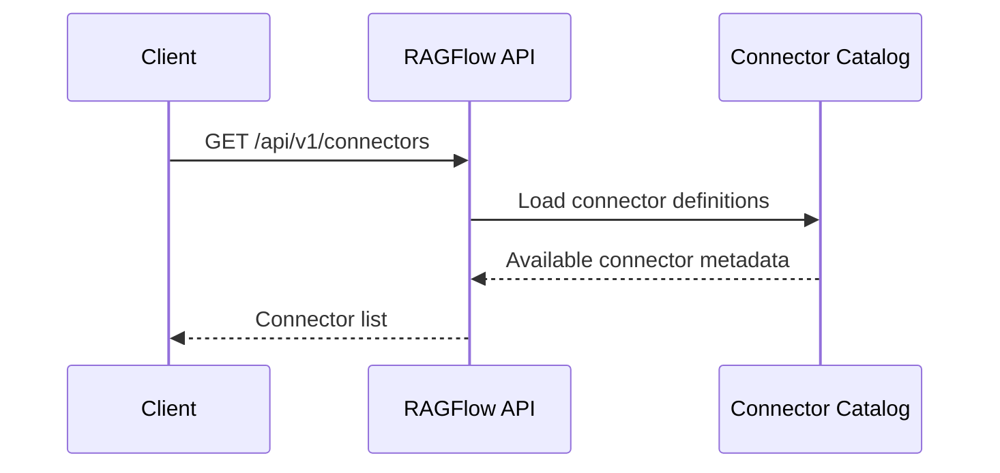
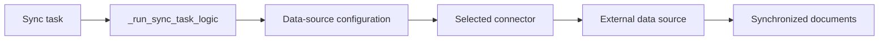
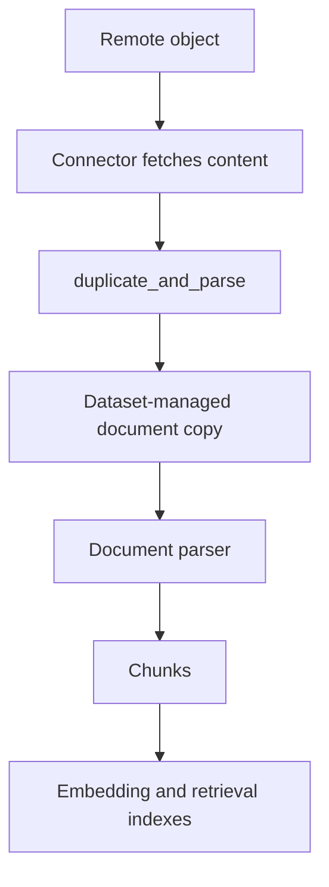
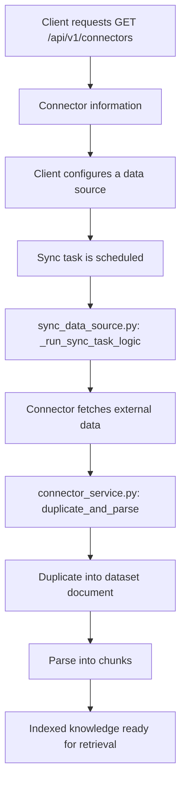

# RAGFlow Data Source Connectors: From Discovery to Chunks

RAGFlow connectors make an external system, such as a cloud drive, collaboration tool, or repository, available as a knowledge source. The implementation separates this work into three responsibilities:

1. Discover which connector types are available.
2. Use the selected connector to synchronize source data.
3. Duplicate and parse the synchronized data into chunks for retrieval.

This separation is useful because a connector describes *how to obtain* content, while the knowledge-base pipeline decides *how to transform* that content into searchable chunks.

---

## 1. Discover Available Connectors

The connector catalog is exposed through:

```text
GET /api/v1/connectors
```

Clients should call this endpoint before presenting a connector-selection UI. The response provides connector information that the client needs to configure a data source, rather than hard-coding a list of supported integrations.

At a high level, the request flow is:



The returned metadata is the contract between the frontend and the ingestion backend. A connector entry can identify the connector type and the configuration information required to authenticate and locate remote content.

The important design point is that this endpoint performs discovery only. It does not fetch files, create documents, or start parsing.

---

## 2. Synchronize Data Through a Connector

After a data source has been configured, RAGFlow synchronizes it in:

```text
rag/svr/sync_data_source.py
```

The main orchestration method is:

```python
_run_sync_task_logic()
```

This method is the operational boundary for connector-based ingestion. It runs the synchronization task, resolves the configured connector, and lets that connector fetch data from the external system.

Conceptually, the worker follows this path:



`_run_sync_task_logic()` should be understood as task orchestration, not as a connector implementation. Each connector owns the remote-system details: authentication, pagination, change detection, and conversion of remote objects into data that RAGFlow can process.

This boundary has two practical benefits:

- New connector types can be added without rewriting the synchronization worker.
- Failures can be diagnosed by stage: task scheduling, configuration, connector access, remote retrieval, or downstream parsing.

---

## 3. Duplicate the Source and Parse It

Fetched data is not immediately usable for retrieval. It must become a document copy that belongs to the dataset and then pass through RAGFlow's parsing pipeline.

The key service method is:

```text
api/db/services/connector_service.py
duplicate_and_parse()
```

`duplicate_and_parse()` bridges connector synchronization and knowledge-base indexing. Its name describes the two essential actions:

1. **Duplicate** the synchronized source into RAGFlow-managed document data.
2. **Parse** that document so it is divided into chunks according to the dataset's parsing configuration.



The duplicate step matters because external content is not necessarily stable, directly addressable, or shaped like a native RAGFlow document. A dataset-owned copy gives the parsing and indexing pipeline a consistent input, while preserving the data source as the system of origin.

The parse step is where a document becomes retrievable. The parser splits the copied content into chunks using the dataset's configured chunking strategy. Those chunks are then the units used for embeddings, indexing, and retrieval.

---

## End-to-End Control Flow

Putting the components together produces this control flow:



The three layers have distinct responsibilities:

| Layer | Main Entry Point | Responsibility |
|---|---|---|
| Connector discovery | `GET /api/v1/connectors` | Expose available connector types and their metadata |
| Synchronization worker | `_run_sync_task_logic()` | Execute a data-source sync using the configured connector |
| Connector service | `duplicate_and_parse()` | Create a dataset document copy and produce chunks |

---

## Debugging by Stage

When a connector-based knowledge source does not produce search results, locate the failure in this order:

1. Call `GET /api/v1/connectors` and verify that the intended connector is present.
2. Verify that the data-source configuration selects that connector and contains valid connection settings.
3. Inspect the sync task handled by `_run_sync_task_logic()` to determine whether the connector successfully fetched remote data.
4. Verify that `duplicate_and_parse()` created a dataset-managed document.
5. Check that parsing produced chunks and that indexing completed.

This ordering prevents a common mistake: diagnosing an indexing problem when the connector never retrieved any data, or diagnosing connector credentials when a document was fetched but parsing failed later.

---

## Takeaway

RAGFlow's data-source ingestion path is intentionally layered. `/api/v1/connectors` answers which integrations are available. `_run_sync_task_logic()` runs the chosen connector to synchronize external content. `duplicate_and_parse()` turns that content into dataset-owned documents and chunks.

Understanding these boundaries makes it easier to add connector support, investigate failed synchronization tasks, and explain why successfully fetched data is not searchable until the duplicate-and-parse stage has completed.
