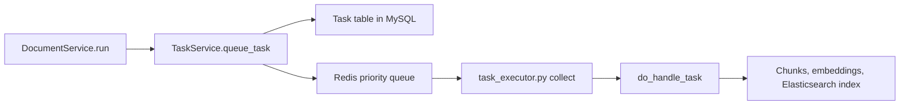

RAGFlow has two main paths for adding knowledge to a dataset. A user can upload a document manually, through the UI or API, or RAGFlow can fetch documents from an external data source such as GitHub or Confluence. The paths begin differently, but both eventually create document-processing tasks that parse content, build chunks, generate embeddings, and index the completed chunks.

This post traces the full ingestion flow, identifies the worker responsible for each stage, and explains what happens when a data source is not linked to a dataset.

## Initial Login and Manual Uploads

When a new RAGFlow deployment starts with an empty MySQL database, it contains a default administrator account. That account can be used to sign in and create datasets.

Documents can then be added manually through the RAGFlow UI or the document API. After upload, the original document is stored in MinIO. Clicking **Parse** starts the document-processing pipeline:

```text
document_app.py / run()
	-> DocumentService.run()
	-> TaskService.queue_task()
	-> Redis queue
	-> task_executor.py
	-> parsing, chunking, embedding, and indexing
```

The API service creates a task record and places a task message onto Redis. A task executor consumes the message and performs the expensive asynchronous work. The result is a set of indexed chunks stored in Elasticsearch and available to retrieval.

## Data Sources Must Be Linked to a Dataset

Creating a connector only stores its configuration, credentials, and refresh frequency. It does not by itself start a document synchronization.

RAGFlow uses the `Connector2Kb` relation to connect a data source to a dataset. This relation provides the target `kb_id` required by every synchronization task. When `Connector2KbService.link_connectors()` links a connector, it creates the association and schedules an immediate synchronization through `SyncLogsService.schedule()`.

```text
Connector2KbService.link_connectors()
	-> Connector2Kb(connector_id, kb_id, auto_parse)
	-> SyncLogsService.schedule(..., run_immediately=True)
	-> sync_log record
```

Without a `Connector2Kb` record, RAGFlow has no target dataset and does not create a synchronization task. The regular connector scheduler also iterates over existing connector-to-dataset relations, so an unlinked connector produces no work:

```text
ConnectorService.schedule_tasks(connector_id)
	-> for each Connector2Kb relation
	-> SyncLogsService.schedule(connector_id, kb_id, ...)
```

This distinction is important:

| Operation | Result |
|---|---|
| Create a connector | Saves connection settings only |
| Link a connector to a dataset | Creates a `Connector2Kb` relation and schedules synchronization |
| Synchronize with `auto_parse=0` | Uploads documents to the dataset without automatically parsing them |
| Synchronize with `auto_parse=1` | Uploads documents and creates parsing tasks automatically |

## The Data-Source Synchronization Worker

`SyncLogsService` records scheduling and synchronization state. It does not directly call GitHub, Confluence, or other external services. The worker that consumes due synchronization records is `rag/svr/sync_data_source.py`.

Its `main()` loop repeatedly calls `dispatch_tasks()`, which asks `SyncLogsService.list_due_sync_tasks()` for scheduled work. It selects an adapter based on the source type, such as GitHub or Confluence, and runs that adapter's `_generate()` method.

```text
SyncLogsService.schedule()
	-> sync_log record

sync_data_source.py / dispatch_tasks()
	-> SyncLogsService.list_due_sync_tasks()
	-> GitHub / Confluence / ... ._generate()
	-> connector calls the external API
	-> Document objects
```

For example, the GitHub adapter delegates API access, pagination, and the conversion of issues, pull requests, or repository files to `common/data_source/github/connector.py`. Confluence, S3-compatible storage, Google Drive, Notion, SharePoint, and other sources use their respective connectors.

The central ingestion logic is `SyncBase._run_sync_task_logic()`. Once a connector has generated a batch of external documents, it passes them to `SyncLogsService.duplicate_and_parse()`:

```text
SyncBase._run_sync_task_logic()
	-> SyncLogsService.duplicate_and_parse()
	-> FileService.upload_document(kb, ...)
	-> DocumentService.run(...) when auto_parse=1
	-> task_executor.py
```

`FileService.upload_document(kb, ...)` is the operation that uploads connector output as documents belonging to the target dataset. Like manual uploads, the source files are retained in the object-storage layer. With automatic parsing enabled, `DocumentService.run()` queues the next stage immediately. With automatic parsing disabled, the documents appear in the dataset but remain unparsed until a user starts parsing them.

## From Database Task to Redis Message

`DocumentService.run()` delegates task creation to `TaskService.queue_task()`. The producer persists the task in the database and explicitly publishes a message to a priority-specific Redis queue:

```python
bulk_insert_into_db(Task, [task], True)
assert REDIS_CONN.queue_product(
	settings.get_svr_queue_name(priority), message=task
)
```

Saving the database row alone does not start processing. The Redis message is the handoff from the API or synchronization service to the asynchronous executor.



## How `task_executor.py` Consumes Work

`rag/svr/task_executor.py` is the consumer process. Its `collect()` coroutine first retries unacknowledged Redis messages, then reads new messages from the configured priority queues. It verifies that the task still exists and has not been cancelled before passing it to the handler.

```text
collect()
	-> retry unacknowledged consumer-group messages
	-> read a new priority-queue message
	-> validate and enrich the task
	-> do_handle_task()
```

This ordering gives the worker at-least-once delivery behavior: a task that was read but not acknowledged can be retried after a failure or worker restart.

`do_handle_task()` dispatches tasks by type. Memory tasks are handled by `handle_save_to_memory_task()`, dataflow tasks run through `run_dataflow()`, and ordinary document tasks use the parsing and chunking path. The executor validates the configured embedding model, initializes the knowledge-base index, reports progress, and processes the document.

Each executor is an asynchronous process with a concurrency limit and a task timeout. Multiple executors can run independently, allowing document-processing capacity to scale separately from the API service.

## Chunking, Embedding, and Elasticsearch

For a document-processing task, the important stages are separate:

```text
do_handle_task()
	-> build_chunks()
	-> embedding()
	-> insert_chunks()
```

`build_chunks()` parses the source document according to its parser configuration and prepares chunk records. The records can contain text, document and dataset identifiers, chunk positions, page information, tags, questions, and other parser-specific metadata. This stage does not persist the records to Elasticsearch.

`embedding()` converts the relevant chunk text and enriched fields into vector representations using the dataset's embedding model. It enriches the prepared chunk records, but it is not the persistence boundary.

Finally, `insert_chunks()` writes the completed chunk records to Elasticsearch. After this step succeeds, the chunks are available for keyword, vector, and hybrid retrieval.

| Symptom | Most relevant stage |
|---|---|
| Incorrect chunk boundaries or missing parser metadata | `build_chunks()` |
| Embedding-provider errors or poor vector quality | `embedding()` |
| Chunks prepared but absent from search | `insert_chunks()` or Elasticsearch |
| No external documents arrive in a dataset | Connector binding, `sync_log`, or `sync_data_source.py` |

## Complete Ingestion Flow

The two ingestion paths converge at document task execution:

```text
Manual upload or API upload
	-> MinIO
	-> user starts Parse
	-> DocumentService.run()

Linked data source
	-> SyncLogsService.schedule()
	-> sync_data_source.py
	-> connector fetches external documents
	-> FileService.upload_document()
	-> DocumentService.run() when auto_parse=1

DocumentService.run()
	-> TaskService.queue_task()
	-> Redis
	-> task_executor.py
	-> build_chunks()
	-> embedding()
	-> insert_chunks()
	-> Elasticsearch
```

The architecture deliberately separates scheduling, external fetching, file ingestion, task queuing, parsing, embedding, and indexing. That separation makes failures easier to locate: inspect connector configuration and `sync_log` records for synchronization problems, Redis and the task executor for queued work, and Elasticsearch for final indexing failures.

## Summary

RAGFlow's data-source synchronization does not run for an unlinked connector. A connector must first be associated with a dataset through `Connector2Kb`; this creates the scheduled synchronization record that `sync_data_source.py` consumes.

The synchronization worker fetches external content through source-specific connectors and calls `SyncLogsService.duplicate_and_parse()` to upload documents into the target dataset. When automatic parsing is enabled, RAGFlow queues a document task. `task_executor.py` consumes that task from Redis, builds chunks, generates embeddings, and persists the final records to Elasticsearch.
