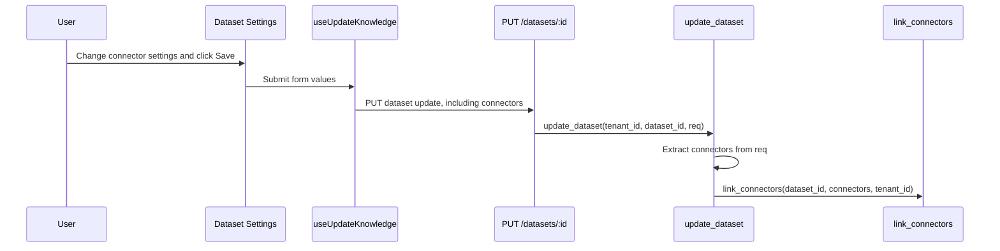

RAGFlow does not expose `Connector2KbService.link_connectors()` as a connector-specific Web API. Instead, the Web UI reaches it indirectly when a user saves Dataset Settings. The connector list is one field in the dataset update payload, so binding, editing, unlinking, and changing a connector's automatic parsing option are persisted together with the other dataset settings.

This post follows that request from the Save button to the connector-to-dataset relation service. The code paths discussed here are based on the RAGFlow `main` branch inspected on July 31, 2026.

## The Complete Call Stack

The trigger is the Dataset Settings page, not a stand-alone connector endpoint:

```text
Dataset Settings page
	-> user clicks Save
	-> SavingButton submits the React Hook Form
	-> useUpdateKnowledge().saveKnowledgeConfiguration(...)
	-> updateKb(datasetId, requestBody)
	-> PUT /api/v1/datasets/{datasetId}
	-> dataset_api.update()
	-> dataset_api_service.update_dataset(tenantId, datasetId, req)
	-> Connector2KbService.link_connectors(datasetId, connectors, tenantId)
```

The server route is `PUT /api/v1/datasets/<dataset_id>`. It validates the update request and passes the parsed request body to `dataset_api_service.update_dataset()`. That function owns the decision to synchronize connector relations; the route itself is only the HTTP boundary.



## What the Web UI Changes

The Dataset Settings form keeps the configured data sources in `form.connectors`. Its connector controls update that in-memory array for three user actions:

| User action | Form-state effect |
|---|---|
| Bind a new data source or edit one | Writes the complete connector configuration into `connectors` |
| Unlink a data source | Removes that connector from `connectors` |
| Change Auto Parse | Updates the selected connector's `auto_parse` value |

These interactions do not immediately issue HTTP requests. They modify form state. The request occurs only when the user clicks **Save**, which submits the complete form through the update mutation.

The mutation keeps the form's connector field in the body while separating the dataset identifier. The resulting request is conceptually similar to this:

```json
{
	"name": "Engineering knowledge base",
	"parser_id": "naive",
	"connectors": [
		{
			"id": "connector-id",
			"auto_parse": true
		}
	]
}
```

The exact connector object contains additional fields defined by RAGFlow's dataset and connector interfaces. The important property for this call path is the presence of `connectors` in the update body.

## Why `connectors` Is the Switch

Inside `update_dataset()`, RAGFlow merges extended fields into the update request, then checks whether `connectors` is present. When it is, the function removes that field from the normal dataset-update fields and retains its value for relation synchronization. After updating the dataset record, it calls `Connector2KbService.link_connectors()` with that connector list.

In simplified form, the relevant control flow is:

```python
connectors = []
if "connectors" in req:
		connectors = req.pop("connectors")

KnowledgebaseService.update_by_id(kb.id, req)
Connector2KbService.link_connectors(kb.id, connectors, tenant_id)
```

This explains why the connector relation is synchronized through the dataset API rather than through a separate request from the settings page. The `connectors` field is a special part of a general dataset update.

## Empty Arrays Are Meaningful

The presence check has an important operational consequence. Once `connectors` is present, the service calls `link_connectors()` even when the value is an empty array:

```json
{
	"connectors": []
}
```

For the connector-to-dataset association, an empty list represents no desired connectors. As a result, saving this payload synchronizes the relation to an empty set, which unlinks the dataset's existing connector associations. The connector service also handles the associated scheduled or running synchronization work as part of that unlinking logic.

This is a useful debugging distinction:

| Request body | Connector relation behavior |
|---|---|
| `connectors` omitted | The dataset update does not request a connector-list change |
| `connectors: [...]` | The service synchronizes relations to the submitted list |
| `connectors: []` | The service synchronizes relations to an empty list, removing existing links |

When investigating an unexpected unlink, inspect the actual `PUT /api/v1/datasets/{id}` payload in the browser's Network panel. In particular, distinguish a missing field from an explicitly submitted empty array.

## Practical Debugging Path

To trace a click in the Web UI to the server-side relation change, work from the request boundary inward:

1. In Dataset Settings, change a connector setting and click **Save**.
2. Confirm that the browser sent `PUT /api/v1/datasets/{datasetId}`.
3. Inspect whether the JSON body contains `connectors`, and whether it is empty or populated.
4. Set a breakpoint or add temporary logging in `dataset_api.update()` and `dataset_api_service.update_dataset()`.
5. Confirm that `Connector2KbService.link_connectors()` receives the expected dataset ID, connector list, and tenant ID.

The most useful breakpoint is in `update_dataset()`: it is the narrow point where a generic dataset save becomes a connector-relation synchronization.

## Takeaway

`link_connectors()` is reached by saving Dataset Settings, not by calling a dedicated connector-link endpoint from the Web UI. Connector controls stage changes in `form.connectors`; the final Save sends the complete dataset update to `PUT /api/v1/datasets/{id}`. The backend extracts `connectors` and delegates relation synchronization to `Connector2KbService.link_connectors()`.

Treat `connectors` as a desired-state field. Its omission means no connector-list update is requested, while an explicit empty array means that no connectors should remain linked to the dataset.

## References

- [RAGFlow Dataset Settings Save button](https://github.com/infiniflow/ragflow/blob/main/web/src/pages/dataset/dataset-setting/saving-button.tsx): Submits the settings form through `useUpdateKnowledge`.
- [RAGFlow Dataset Settings page](https://github.com/infiniflow/ragflow/blob/main/web/src/pages/dataset/dataset-setting/index.tsx): Maintains connector edits in the dataset settings form state.
- [RAGFlow knowledge update hook](https://github.com/infiniflow/ragflow/blob/main/web/src/hooks/use-knowledge-request.ts): Builds the dataset-update mutation and forwards the form payload to `updateKb`.
- [RAGFlow knowledge service](https://github.com/infiniflow/ragflow/blob/main/web/src/services/knowledge-service.ts): Issues the dataset update HTTP request.
- [RAGFlow Web API paths](https://github.com/infiniflow/ragflow/blob/main/web/src/utils/api.ts): Defines the frontend's `/api/v1` endpoint paths.
- [RAGFlow dataset update route](https://github.com/infiniflow/ragflow/blob/main/api/apps/restful_apis/dataset_api.py): Registers `PUT /datasets/<dataset_id>` and delegates to the dataset service.
- [RAGFlow dataset update service](https://github.com/infiniflow/ragflow/blob/main/api/apps/services/dataset_api_service.py): Extracts `connectors` from the update payload and calls `link_connectors`.
- [RAGFlow connector relation service](https://github.com/infiniflow/ragflow/blob/main/api/db/services/connector_service.py): Creates, updates, or removes connector-to-dataset relations and manages their synchronization tasks.
