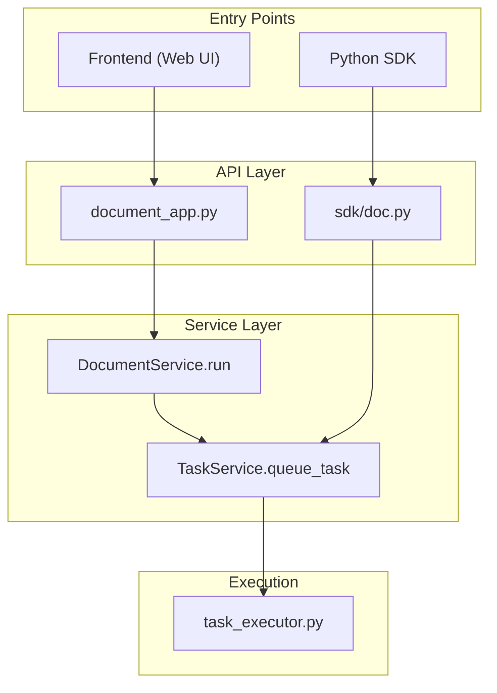
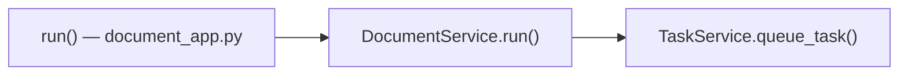
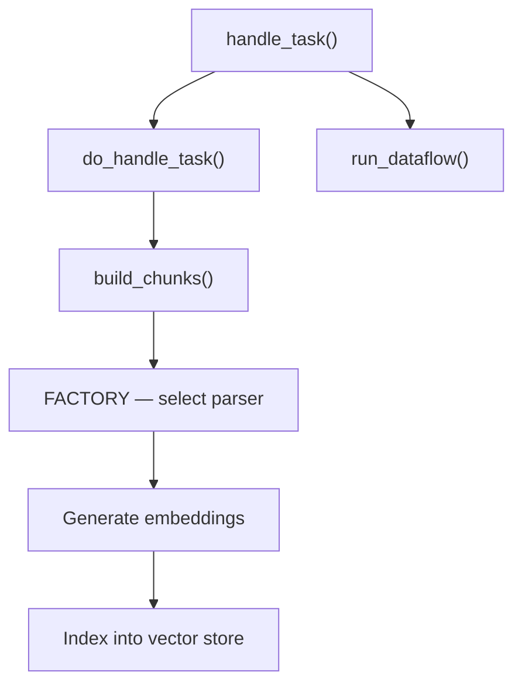

# Deep Dive: RAGFlow's Document Parsing Pipeline

RAGFlow is an open-source RAG (Retrieval-Augmented Generation) engine that provides deep document understanding capabilities. One of its core features is the document parsing pipeline — the mechanism that takes uploaded documents, breaks them into meaningful chunks, generates embeddings, and stores them for retrieval. This post walks through the architecture of that pipeline, from the frontend trigger all the way down to the task executor.

> **Source reference:** All code links point to RAGFlow commit [`c217b8f3`](https://github.com/infiniflow/ragflow/tree/c217b8f3).

---

## Overview

When a user uploads a document and triggers parsing, the request flows through three main layers:

1. **Frontend / SDK** — the entry point where users initiate document parsing.
2. **API & Service Layer** — validates the request, persists metadata, and enqueues parsing tasks.
3. **Task Executor** — asynchronously picks up tasks, chunks the document, generates embeddings, and indexes the results.

---

## Frontend Flow

The web UI triggers parsing through a chain of React hooks and service calls:

| Component | Role |
|-----------|------|
| [`IconMap`](https://github.com/infiniflow/ragflow/blob/c217b8f3/web/src/pages/dataset/dataset/parsing-status-cell.tsx#L26) | Maps document status to icon visuals |
| [`handleOperationIconClick`](https://github.com/infiniflow/ragflow/blob/c217b8f3/web/src/pages/dataset/dataset/parsing-status-cell.tsx#L121) | Handles user click on parse/reparse icon |
| [`useHandleRunDocumentByIds`](https://github.com/infiniflow/ragflow/blob/c217b8f3/web/src/pages/dataset/dataset/use-run-document.ts#L5) | React hook that batches document IDs for parsing |
| [`useRunDocument`](https://github.com/infiniflow/ragflow/blob/c217b8f3/web/src/hooks/use-document-request.ts#L263) | Calls the backend API via registered service |
| [`registerServer`](https://github.com/infiniflow/ragflow/blob/c217b8f3/web/src/utils/register-server.ts#L15) | Utility for binding API endpoints |
| [`kbService`](https://github.com/infiniflow/ragflow/blob/c217b8f3/web/src/services/knowledge-service.ts#L233) | Register knowledge service |

The API endpoint is registered using [`register_page`](https://github.com/infiniflow/ragflow/blob/c217b8f3/api/apps/__init__.py), which provides a path prefix of `{API_VERSION}/{page_name}` for all routed pages.

Once the user clicks the parse button, the request reaches the backend by `kbService.document_run`:

---

## SDK Flow

The Python SDK provides a more direct path. Calling `parse()` on a document object enqueues the task without going through the full web API layer:

---

## API & Service Layer

### API Endpoints

**Frontend API** (`document_app.py`):

| Endpoint | Service Call | Description |
|----------|-------------|-------------|
| [`upload`][doc_app.up_doc] | `FileService.upload_document` | Uploads a new document to the dataset |
| [`run`](https://github.com/infiniflow/ragflow/blob/c217b8f3/api/apps/document_app.py#L604-L663) | `DocumentService.run` | Triggers parsing of a document |
| [`get`][doc_app.get_doc] | `File2DocumentService.get_storage_address` | Retrieves a document's storage location |

**SDK API** (`doc.py`):

| Endpoint | Service Call | Description |
|----------|-------------|-------------|
| [`upload`][doc_api.up_doc] | `FileService.upload_document` | Uploads a document via SDK |
| [`parse`](https://github.com/infiniflow/ragflow/blob/c217b8f3/api/apps/sdk/doc.py#L818-L896) | `TaskService.queue_tasks` | Queues a parse task via SDK |

### Key Services

- **[`DocumentService.run`][doc_srv.run]** — The main orchestrator. When a customized `pipeline_id` is provided, it delegates to `TaskService.queue_dataflow`; otherwise, it falls back to `TaskService.queue_task`.

- **[`doc_upload_and_parse`][doc_srv.up_parse_doc]** — A convenience method that performs the full pipeline in one call: chunk the document, generate embeddings, and insert the results.

- **[`upload_document` (FileService)][file_srv.up_doc]** — Persists the raw document to storage.

- **[`queue_raptor_o_graphrag_tasks`][doc_src.q_r_g]** — Creates specialized tasks for RAPTOR (tree-based summarization) or GraphRAG (knowledge-graph-based retrieval).

- **[`insert` (DocumentService)][doc_src.ins_doc]** — Inserts parsed document records into the database.

- **`queue_tasks` (TaskService)** — Enqueues tasks and calls `DocumentService.begin2parse` to mark the document as being processed.

### Storage

The storage backend is abstracted through [`StorageFactory`](https://github.com/infiniflow/ragflow/blob/c217b8f3/common/settings.py#L158-L172), which supports multiple backends (local filesystem, MinIO, S3, etc.) and is selected via configuration.

---

## Task Execution

The heavy lifting happens in [`task_executor.py`](https://github.com/infiniflow/ragflow/blob/c217b8f3/rag/svr/task_executor.py), which runs as an independent worker process:

1. **[`handle_task`](https://github.com/infiniflow/ragflow/blob/c217b8f3d886ca5e650091ba0b7fff2465bae1b0/rag/svr/task_executor.py#L1212-L1258)** — Entry point that dequeues a task, then calls `do_handle_task` or `run_dataflow` depending on the task type.

2. **[`build_chunks`](https://github.com/infiniflow/ragflow/blob/c217b8f3/rag/svr/task_executor.py#L245-L519)** — The core chunking logic. It selects the appropriate parser based on document type, splits the content into chunks, and prepares them for embedding.

3. [**`FACTORY`**](https://github.com/infiniflow/ragflow/blob/c217b8f3/rag/svr/task_executor.py#L85-L102) — A registry of all supported document parsers (naive, paper, book, presentation, laws, table, manual, etc.).

The overall execution flow looks like this:

---

## Open Questions

- **What is the purpose of [`parse` in `document_app.py`](https://github.com/infiniflow/ragflow/blob/c217b8f3/api/apps/document_app.py#L850)?** This endpoint appears to use `seleniumwire.webdriver`, suggesting it may be designed for parsing web pages or dynamically rendered content rather than static documents.

- **What code consumes [`api_utils.py`](https://github.com/infiniflow/ragflow/blob/c217b8f3/api/utils/api_utils.py)?** This utility module likely provides shared helpers (auth decorators, response formatting, etc.) used across multiple API endpoints.

---

## References

- <https://deepwiki.com/infiniflow/ragflow/6-document-processing-pipeline>
- <https://deepwiki.com/search/parseapi_e1cad233-8355-444f-be09-60655753d9e8?mode=fast>

[doc_app.up_doc]:       https://github.com/infiniflow/ragflow/blob/c217b8f3/api/apps/document_app.py#L65-L110
[doc_app.get_doc]:      https://github.com/infiniflow/ragflow/blob/c217b8f3/api/apps/document_app.py#L721-L741
[doc_api.up_doc]:       https://github.com/infiniflow/ragflow/blob/c217b8f3/api/apps/sdk/doc.py#L74-L183
[doc_src.ins_doc]:      https://github.com/infiniflow/ragflow/blob/c217b8f3/api/db/services/document_service.py#L351-L358
[doc_src.q_r_g]:        https://github.com/infiniflow/ragflow/blob/c217b8f3/api/db/services/document_service.py#L973-L1008
[doc_srv.run]:          https://github.com/infiniflow/ragflow/blob/c217b8f3/api/db/services/document_service.py#L950-L970
[doc_srv.up_parse_doc]: https://github.com/infiniflow/ragflow/blob/c217b8f3/api/db/services/document_service.py#L1018-L1164
[file_srv.up_doc]:      https://github.com/infiniflow/ragflow/blob/c217b8f3/api/db/services/file_service.py#L430-507