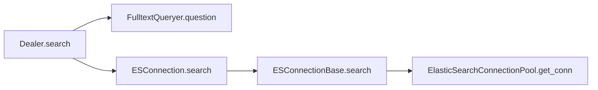

# RAGFlow Search Flow: A Deep Dive into the Retrieval Pipeline

RAGFlow is an open-source RAG (Retrieval-Augmented Generation) engine that combines full-text search with LLM capabilities. Understanding how a user's search query travels through the system — from the frontend UI all the way down to Elasticsearch — is essential for anyone contributing to or extending the project. This post traces that journey end to end.

---

## Overview

At a high level, a search request passes through the following layers:

| Layer | Key Component | Responsibility |
|-------|--------------|----------------|
| **Router** | `Dealer.search` | Orchestrates the search pipeline |
| **Query Builder** | `FulltextQueryer.question` | Converts a natural-language question into an Elasticsearch query |
| **Connection** | `ESConnection.search` | Executes the query against Elasticsearch |
| **Connection Base** | `ESConnectionBase.search` | Abstract search interface for the document store |
| **Pool** | `ElasticSearchConnectionPool.get_conn` | Returns a pooled `Elasticsearch` client instance |

The following diagram illustrates the call chain:

---

## Frontend: How a Query Is Dispatched

The search UI lives under the `next-search` page module. The flow from component to hook works as follows:

1. **[`searchingParam`][searching]** — The top-level search component that captures user input and renders results.
2. It calls **[`useSearching`][hook_search]**, a custom React hook that manages search state and lifecycle.
3. `useSearching` internally relies on **[`useSendQuestion`][hook_send]**, which exposes the `send` method responsible for issuing the HTTP request to the backend.

In short: **Component → `useSearching` → `useSendQuestion.send()` → HTTP POST**.

[searching]:   https://github.com/infiniflow/ragflow/blob/main/web/src/pages/next-search/searching.tsx#L17
[hook_send]:   https://github.com/infiniflow/ragflow/blob/main/web/src/pages/next-search/hooks.ts#L313
[hook_search]: https://github.com/infiniflow/ragflow/blob/main/web/src/pages/next-search/hooks.ts#L469

---

## Backend: Two Paths to Retrieval

RAGFlow exposes two primary backend entry points for search, both of which ultimately converge on the same retrieval logic.

### Path 1 — SDK Retrieval (`/retrieval`)

This is the programmatic path used by the **[ragflow-sdk][ragflow_sdk]**:

1. The SDK's `retrieve()` method sends a **POST** request to the `/retrieval` endpoint, which is defined in **[`doc.py`][sdk_doc]**.
2. The endpoint handler delegates to **[`retriever.retrieval()`][sdk_doc_1]**, which performs the actual document retrieval against the configured document store.

### Path 2 — Conversational Ask (`/ask`)

This path is used by the chat/conversation interface:

1. The **[`/ask`][conv_app_1]** endpoint receives the user's question.
2. It invokes `async_ask()`, which is implemented in **[`dialog_service.py`][dial_srv]**.
3. Inside `async_ask()`, the same `retriever.retrieval()` function is called, ensuring consistent retrieval behavior regardless of the entry point.

### Convergence

Both paths funnel into `retriever.retrieval()`, which uses `Dealer.search` (described above) to execute the Elasticsearch query. This shared design keeps retrieval logic centralized and avoids duplication between the SDK and the conversational API.

[ragflow_sdk]: https://github.com/infiniflow/ragflow/blob/main/sdk/python/ragflow_sdk/ragflow.py#L194
[sdk_doc]:     https://github.com/infiniflow/ragflow/blob/main/api/apps/sdk/doc.py#L1587
[sdk_doc_1]:   https://github.com/infiniflow/ragflow/blob/main/api/apps/sdk/doc.py#L1763
[conv_app]:    https://github.com/infiniflow/ragflow/blob/main/api/apps/conversation_app.py#L391
[conv_app_1]:  https://github.com/infiniflow/ragflow/blob/main/api/apps/conversation_app.py#L409
[dial_srv]:    https://github.com/infiniflow/ragflow/blob/main/api/db/services/dialog_service.py#L1357

---

## Key Takeaways

- **`Dealer.search`** is the central orchestrator — it builds the query via `FulltextQueryer` and executes it through the ES connection pool.
- **Connection pooling** (`ElasticSearchConnectionPool`) ensures Elasticsearch clients are reused efficiently.
- **Frontend hooks** (`useSearching`, `useSendQuestion`) cleanly separate UI concerns from data-fetching logic.
- **Both the SDK and the conversation API** share the same retrieval pipeline, making the system easy to reason about and maintain.