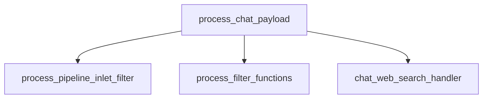
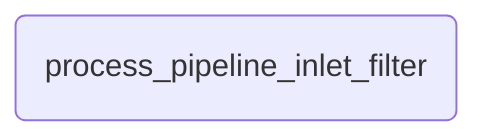

## backend/open_webui/utils/middleware.py


## backend/open_webui/routers/pipelines.py


## StatusItem.svelte
```html
{#if status?.action === 'web_search' && (status?.urls || status?.items)}
```

## References

- <https://deepwiki.com/search/pipelinetool_a9e6e397-f871-4756-b5b7-f1e07d81ff2a>