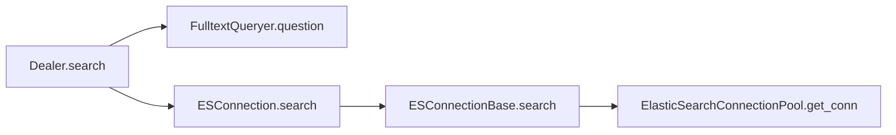

# Flowchart

`Dealer.search` is router,
`FulltextQueryer.question` convert question to query,
`ESConnection.search` is instance,
`ElasticSearchConnectionPool.get_conn` return `Elasticsearch` instance

