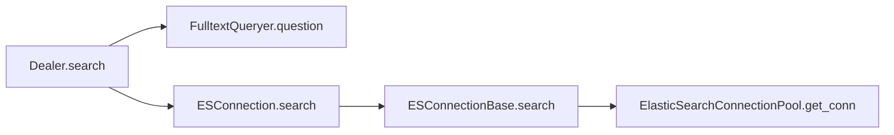

# Flowchart

`Dealer.search` is router,
`FulltextQueryer.question` convert question to query,
`ESConnection.search` is instance,
`ElasticSearchConnectionPool.get_conn` return `Elasticsearch` instance

## Frontend Details

- [`searchingParam`][searching] invoke [`useSearching`][hook_search] invoke [`useSendQuestion`][hook_send] to set `send` method

[searching]:   https://github.com/infiniflow/ragflow/blob/main/web/src/pages/next-search/searching.tsx#L17
[hook_send]:   https://github.com/infiniflow/ragflow/blob/main/web/src/pages/next-search/hooks.ts#L313
[hook_search]: https://github.com/infiniflow/ragflow/blob/main/web/src/pages/next-search/hooks.ts#L469

## Backend Details

- [`ragflow-sdk`][ragflow_sdk] provide `retrieve()` API which post `/retrieval` provided by [`doc.py`][sdk_doc]
- [`/retrieval`][sdk_doc] invoke [`retriever.retrieval()`][sdk_doc_1]
- [`/ask`][conv_app_1] invoke `async_ask()` provided by [`dialog_service.py`][dial_srv]
- [`async_ask()`][dial_srv] invoke `retriever.retrieval()`

[ragflow_sdk]: https://github.com/infiniflow/ragflow/blob/main/sdk/python/ragflow_sdk/ragflow.py#L194
[sdk_doc]:     https://github.com/infiniflow/ragflow/blob/main/api/apps/sdk/doc.py#L1587
[sdk_doc_1]:   https://github.com/infiniflow/ragflow/blob/main/api/apps/sdk/doc.py#L1763
[conv_app]:    https://github.com/infiniflow/ragflow/blob/main/api/apps/conversation_app.py#L391
[conv_app_1]:  https://github.com/infiniflow/ragflow/blob/main/api/apps/conversation_app.py#L409
[dial_srv]:    https://github.com/infiniflow/ragflow/blob/main/api/db/services/dialog_service.py#L1357