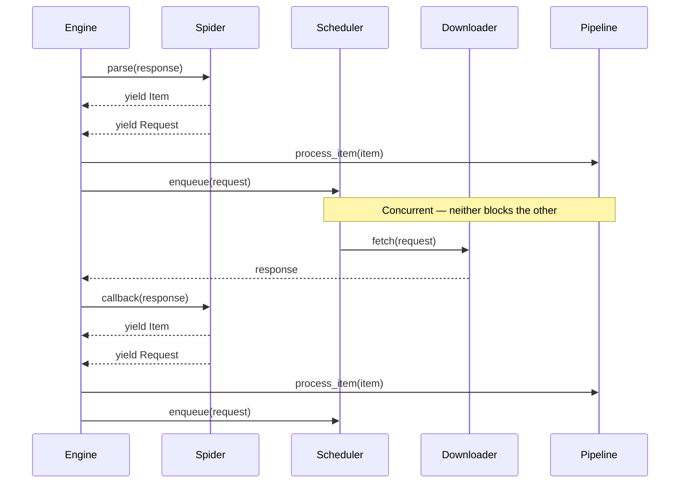

# Scrapy: Spider.parse → ItemPipeline → New Request Flow

## Overview

A common question is: *does Scrapy return control to `Spider.parse` after `ItemPipeline` finishes?*

**Short answer: No.** `ItemPipeline` and new `Request` scheduling are two **independent, concurrent paths** managed by Scrapy's async engine. `parse()` is a generator — it yields objects and the engine routes them. The engine never "returns" to `parse()` because of an item completing the pipeline.

---

## Architecture: The Two Paths

When `Spider.parse()` runs, it can yield two types of objects:

| Yielded Type | Engine Action |
|---|---|
| `scrapy.Item` / `dict` | Sent to **ItemPipeline** for processing |
| `scrapy.Request` | Sent to **Scheduler** for future downloading |

Both paths run **asynchronously** via Scrapy's [Twisted](https://twisted.org/) event loop. They do not block each other, and neither returns control back to `parse()`.

---

## Full Data Flow

```
Spider.parse()
      │
      ├── yield Item ──────────────────────────────────────────────────────────────────────────▶ ItemPipeline
      │                                                                                               │
      │                                                                                    process_item() chain
      │                                                                                               │
      │                                                                                      (Item saved / dropped)
      │
      └── yield Request ──▶ Scheduler ──▶ Downloader ──▶ Response ──▶ Request.callback()
                                                                              │
                                                                    (e.g., Spider.parse_detail)
                                                                              │
                                                                     yield Item ──▶ ItemPipeline
                                                                     yield Request ──▶ Scheduler
```

---

## Step-by-Step Walkthrough

### Step 1 — Spider.parse() is a generator

`parse()` uses `yield` to produce objects lazily. The engine calls `next()` on it, collects what was yielded, and routes it. The method itself does not wait for the pipeline or the next download to complete.

```python
import scrapy

class BookSpider(scrapy.Spider):
    name = "books"
    start_urls = ["https://books.toscrape.com/"]

    def parse(self, response):
        # Yield an Item → goes to ItemPipeline
        yield {
            "title": response.css("h1::text").get(),
            "url": response.url,
        }

        # Yield a Request → goes to Scheduler
        next_page = response.css("li.next a::attr(href)").get()
        if next_page:
            yield response.follow(next_page, callback=self.parse)
```

### Step 2 — The Engine routes each yielded object

Scrapy's `ExecutionEngine` receives the yielded objects and immediately dispatches them:

- **Item** → passed to `ItemPipelineManager.process_item()` (runs through every pipeline stage)
- **Request** → passed to `Scheduler.enqueue_request()` (queued for downloading)

This routing is synchronous in terms of dispatch, but the actual work (pipeline processing, HTTP download) is asynchronous.

### Step 3 — ItemPipeline processes the Item independently

Each `ITEM_PIPELINES` class in `settings.py` receives the item in order of priority. Pipeline processing does **not** pause spider execution or affect Request scheduling.

```python
# settings.py
ITEM_PIPELINES = {
    "myproject.pipelines.ValidationPipeline": 100,
    "myproject.pipelines.DatabasePipeline": 300,
}
```

```python
# pipelines.py
class DatabasePipeline:
    def process_item(self, item, spider):
        # This runs completely independent of any new Request being fetched
        self.db.insert(item)
        return item
```

### Step 4 — The Scheduler feeds the Downloader

The `Scheduler` dequeues a `Request` and passes it to the `Downloader`. Concurrency is controlled by:

- `CONCURRENT_REQUESTS` — max parallel downloads
- `CONCURRENT_REQUESTS_PER_DOMAIN` — per-domain limit

### Step 5 — The callback is invoked with the Response

When the download completes, the engine calls `Request.callback(response)`. This callback is what produces the next wave of Items and Requests — it could be the same `parse()` method or a different one (e.g., `parse_detail`).

```python
def parse(self, response):
    for book_url in response.css("article.product_pod a::attr(href)"):
        # New Request with a different callback
        yield response.follow(book_url, callback=self.parse_detail)

    # Pagination Request fed back to parse()
    next_page = response.css("li.next a::attr(href)").get()
    if next_page:
        yield response.follow(next_page, callback=self.parse)

def parse_detail(self, response):
    yield {
        "title": response.css("h1::text").get(),
        "price": response.css("p.price_color::text").get(),
    }
```

---

## Mermaid Sequence Diagram



---

## Key Takeaways

1. **`parse()` does not resume after ItemPipeline finishes.** The pipeline and new Request fetching run on separate async paths.
2. **`parse()` is re-entered only via a `Request` callback**, not by the pipeline completing.
3. **Items and Requests yielded from the same `parse()` call are dispatched concurrently.** The engine does not wait for the item to complete the pipeline before starting to fetch the next URL.
4. **Dropping an item in the pipeline** (raising `DropItem`) has zero effect on pending or future Requests.
5. **If you need to send a new Request based on a pipeline result**, use `scrapy.crawler.Crawler` signals or restructure the logic in `parse()` before yielding the item.

---

## Common Misconception

```python
def parse(self, response):
    yield {"title": "foo"}        # ← does NOT block here waiting for pipeline
    yield response.follow("/next") # ← scheduled immediately alongside the item above
```

Many developers assume the second `yield` only executes after the item finishes the pipeline. It does not. The engine drains the generator greedily and routes each yielded object as soon as it appears.

---

## References

- [Scrapy Architecture Overview](https://docs.scrapy.org/en/latest/topics/architecture.html)
- [Scrapy Item Pipeline](https://docs.scrapy.org/en/latest/topics/item-pipeline.html)
- [Scrapy Spiders](https://docs.scrapy.org/en/latest/topics/spiders.html)
- [Scrapy Settings: Concurrency](https://docs.scrapy.org/en/latest/topics/settings.html#concurrent-requests)
